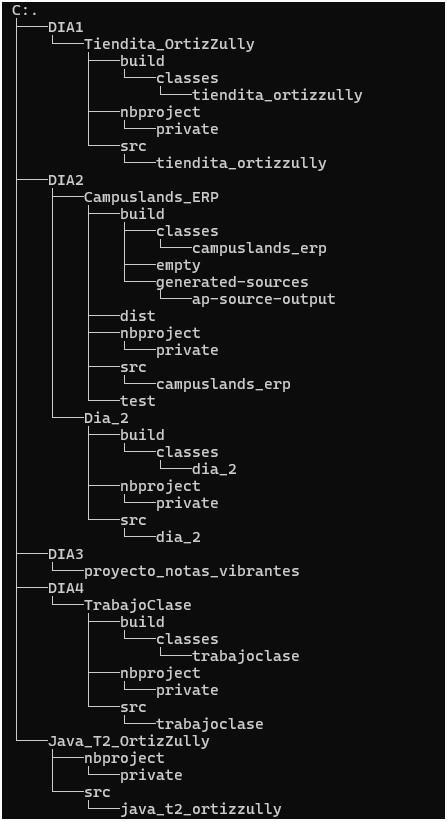

# Java_OrtizZully

Este repositorio contiene diversos proyectos y ejercicios en Java, Organizados en diferentes carpetas.

## Contenido 

* 📂 Dia1
---
 
| 🔹 Proyecto | 📜 Descripción |
|--------|-----------|
|**Tiendita_OrtizZully**| Este proyecto contiene un CRUD de una tienda que es llamada MAKEUP STORE.|
---
* 📂 Dia2
---
| 🔹 Proyecto | 📜 Descripción |
|--------|-----------|
|**Campuslands_ERP**| Gestion de Campusland donde pueden gestionar Campers, coordinador y trainers donde cada uno contiene un CRUD correspondiente.|
|**Dia2**| Contiene la explicacion de P.O.O y la creacion de constructores.|
---
* 📂 Dia3
---
| 🔹 Proyecto | 📜 Descripción |
|--------|-----------|
|**Proyecto_notas_vibrantes**| Proyecto de notas vibrantes donde puede gestionar Clientes, Concierto, Ticket y Zona donde puede tambien hacer CRUD. |
---
* 📂 Dia4
---
| 🔹 Proyecto | 📜 Descripción |
|--------|-----------|
|**TrabajoClase**| Investigacion sobre herencia, encapsulamiento y polimorfismo donde cada uno consta de un ejemplo. |
---
* 📂 Java_OrtizZully
---
| 🔹 Proyecto | 📜 Descripción |
|--------|-----------|
|**Java_T2_OrtizZully**| Explicacion de la elaboracion de CRUD. |
---

## Estructura

## Instalacion y uso.

- Debes tener netbeans
- Descagas las carpetas y lo abres.
- Ejecutar codigo

## 🛠️ Lenguajes usados 

* Java 

## Créditos.

Elaborado por Zulluy Fernanda Ortiz Avendaño Cc. 1092528097